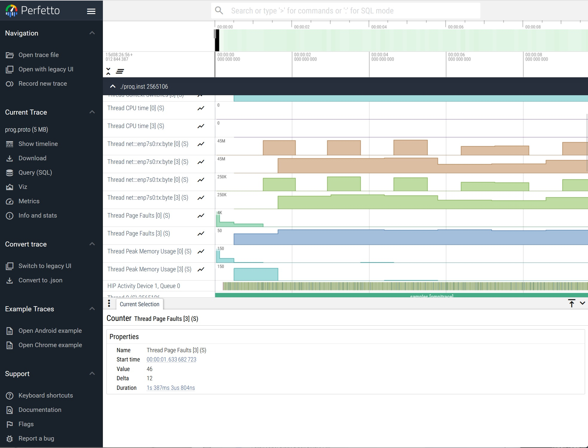

# nic-profiling-sample
Sample application for NIC profiling

## Introduction

This project contains the code and scripts needed to demonstrate network performance
profiling in ROCm.

## Configuring

To get your NIC name, use:

    ip a

or

    ifconfig

By default, prog.cfg is configured for enp7s0.

Once you know your NIC, edit prog.cfg and modify this line:


    ROCPROFSYS_PAPI_EVENTS = net:::enp7s0:tx:byte net:::enp7s0:rx:byte net:::enp7s0:rx:packet net:::enp7s0:tx:packet

Then run

    . ./setenv.sh

to set the environment.

## Building and running

This project's Makefile compiles source code file prog.cc to prog, instruments prog to generate prog.inst
and runs rocprof-sys-instrument with prog.inst to generate Perfetto proto file.

To do everything in one step, run

    make rebuild

If everything is successful, that command will generate prog.proto, which will contain
network performance trace.

Read the .proto file in the browser by opening the page

[Perfetto UI](https://ui.perfetto.dev/)

## Simulating network traffic

In order to try this sample out with some realistic network traffic, the script
[download.sh](https://github.com/ajanicijamd/nic-profiling-sample/blob/main/download.sh)
is included in this project. Open another shell and run the script:

    ./download.sh

It will start downloading an Ubuntu ISO file. While it is downloading, run make rebuild as described
in the previous section.

Remember to stop the download.sh script once the profiling is done.


## Network Performance Profiling

The following documentation is copied from the
[README](https://github.com/ROCm/pytorch-profiling-examples-internal/blob/main/rocm-system-profiler/README.md)
of
[rocm-system-profiler](https://github.com/ROCm/pytorch-profiling-examples-internal/tree/main/rocm-system-profiler).

ROCm System supports network profiling. It just has to be configured to do network sampling.

All network events that can be traced on the system can be listed by running the command:

    omnitrace-avail -H -r net

For example, if the system's NIC is enp7s0, then the output of that command that is related to
that NIC looks like this:

```
| net:::enp7s0:rx:bytes          |   CPU   |   true    | enp7s0 receive bytes           |
| net:::enp7s0:rx:packets        |   CPU   |   true    | enp7s0 receive packets         |
| net:::enp7s0:rx:errors         |   CPU   |   true    | enp7s0 receive errors          |
| net:::enp7s0:rx:dropped        |   CPU   |   true    | enp7s0 receive dropped         |
| net:::enp7s0:rx:fifo           |   CPU   |   true    | enp7s0 receive fifo            |
| net:::enp7s0:rx:frame          |   CPU   |   true    | enp7s0 receive frame           |
| net:::enp7s0:rx:compressed     |   CPU   |   true    | enp7s0 receive compressed      |
| net:::enp7s0:rx:multicast      |   CPU   |   true    | enp7s0 receive multicast       |
| net:::enp7s0:tx:bytes          |   CPU   |   true    | enp7s0 transmit bytes          |
| net:::enp7s0:tx:packets        |   CPU   |   true    | enp7s0 transmit packets        |
| net:::enp7s0:tx:errors         |   CPU   |   true    | enp7s0 transmit errors         |
| net:::enp7s0:tx:dropped        |   CPU   |   true    | enp7s0 transmit dropped        |
| net:::enp7s0:tx:fifo           |   CPU   |   true    | enp7s0 transmit fifo           |
| net:::enp7s0:tx:colls          |   CPU   |   true    | enp7s0 transmit colls          |
| net:::enp7s0:tx:carrier        |   CPU   |   true    | enp7s0 transmit carrier        |
| net:::enp7s0:tx:compressed     |   CPU   |   true    | enp7s0 transmit compressed     |
```

Note that currently there is a discrepancy in the reported events and how ROCm System should
be configured:

- net:::enp7s0:rx:bytes should be changed to net:::enp7s0:rx:byte
- net:::enp7s0:tx:bytes should be changed to net:::enp7s0:tx:byte
- net:::enp7s0:tx:packets should be changed to net:::enp7s0:tx:packet
- net:::enp7s0:rx:packets should be changed to net:::enp7s0:rx:packet

So, configuration parameters to track bytes sent and received for the NIC enp7s0 should be
configured as follows:

    OMNITRACE_PAPI_EVENTS = net:::enp7s0:tx:byte net:::enp7s0:rx:byte

### Configuration

To summarize, the following configuration parameters set:

- network interface: enp7s0
- sampling frequency: 10 per second
- timemory configuration: wall_clock, papi_array, network_stats
- PAPI events: net:::enp7s0:tx:byte net:::enp7s0:rx:byte

The parameter settings look like this:

```
OMNITRACE_SAMPLING_FREQ = 10
OMNITRACE_USE_SAMPLING = ON
OMNITRACE_TIMEMORY_COMPONENTS=wall_clock papi_array network_stats
OMNITRACE_NETWORK_INTERFACE=enp7s0
OMNITRACE_PAPI_EVENTS = net:::enp7s0:tx:byte net:::enp7s0:rx:byte
```

Here is a complete prog.cfg configuration file:

```
OMNITRACE_CI                     = ON
OMNITRACE_VERBOSE                = 1
OMNITRACE_DL_VERBOSE             = 1
OMNITRACE_SAMPLING_FREQ          = 10
OMNITRACE_SAMPLING_DELAY         = 0.05
OMNITRACE_SAMPLING_CPUS          = 0-9
OMNITRACE_SAMPLING_GPUS          = $env:HIP_VISIBLE_DEVICES
OMNITRACE_ROCTRACER_HSA_API      = ON
OMNITRACE_ROCTRACER_HSA_ACTIVITY = ON

OMNITRACE_TRACE=ON
OMNITRACE_PROFILE=ON
OMNITRACE_USE_SAMPLING=ON
OMNITRACE_USE_PROCESS_SAMPLING=OFF
OMNITRACE_TIME_OUTPUT=OFF
OMNITRACE_FILE_OUTPUT=ON
OMNITRACE_TIMEMORY_COMPONENTS=wall_clock papi_array network_stats
OMNITRACE_USE_PID=OFF
OMNITRACE_NETWORK_INTERFACE=enp7s0
OMNITRACE_PAPI_EVENTS = net:::enp7s0:tx:byte net:::enp7s0:rx:byte
```

In order to build and run a trace, some environment variables need to be set.
Here is an example setting:

```
LD_LIBRARY_PATH=~/Work/build-omnitrace/lib
PYTHONPATH=/home/aleks/Work/build-omnitrace/lib/python3.10/site-packages
OMNITRACE_CONFIG_FILE=/home/aleks/Work/proto/prog.cfg
OMNITRACE_OUTPUT_PATH=omnitrace-tests-output
OMNITRACE_OUTPUT_PREFIX=/home/aleks/Work/proto
```

The following settings are for the path where shared libraries are found, the path
for Python modules, ROCm System config file, output path and output prefix.

An example omnitrace-instrument command is:

```
~/Work/build-omnitrace/bin/omnitrace-instrument -o prog.inst  \
            --log-file mylog.log --verbose --debug \
                "--print-instrumented" "functions" "-e" "-v" "2" "--caller-include" \
                "inner" "-i" "4096" "--" ./prog
```

An example omnitrace-run command to produce a .proto file is:

```
~/Work/build-omnitrace/bin/omnitrace-run "--" ./prog.inst
```

The resulting .proto file looks like this:



